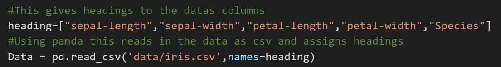
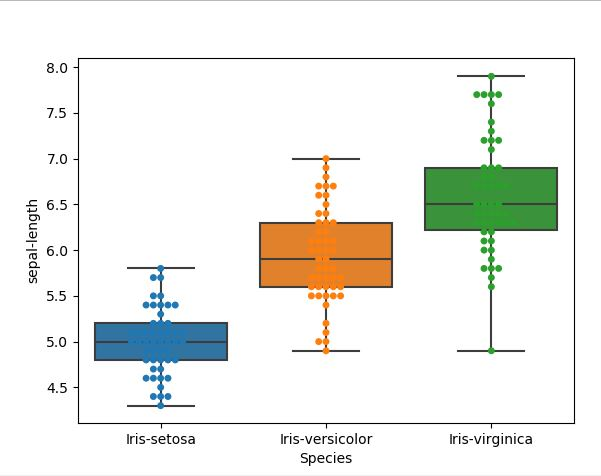

# Fisher's Iris data set

## About 
The Iris flower data set was first introduced by the British statistician Ronald Fisher in 1936 as an example of linear discriminant analysis (Fisher 1936). It has since become a classical example of a multivariate dataset which involves the observation and analysis of more than one statistical outcome variable at a time (Field, Miles and Field 2013). Its popularity as a dataset is possibly best exemplified by a simple google scholar search of the term “iris dataset” which returns over 7000 publications. The data set consists of fifty samples from each of three species of Iris (Fig 1). For each sample, four features were measured, namely: the length and the width of both the sepals and petals.
 

 
Fig 1: Illustration of the three Iris species

## Task
The aim of this task is to import, organize and describe this dataset

## How to import the csv dataset into python 

* Step 1 - Download the dataset from UCI machine learning repository [3]  
* Step 2 - Import your dataset in python as csv
* Step 3 - Use the open source platform pandas[4],numpy[5] & seaborn[6] 

* Step 3 - Assign headings for the species if your dataset does not contain headers.

## How to organize the data 
* Step 1 - Check for any empty cells and remove these from the dataset 

## How to describe the data 

* Step 1 - Use the groupby function to arrange data by species 
* Step 2 - Get the mean and standard deviation for each of species  

* Step 3 - Explore the data using boxplots with overlay of actual datapoints. 

Boxplots give a visual representation of the data. The top and bottom of the box are the 75th and 25th percentiles respectivly. The horizontal line in the box represents the median value.The dashlines known as the whiskers show the rest of the distribution except for points that are determined to be outliers[7]. 

  

  

 

## Conclusion 

Based on this preliminary exploratory analysis of the iris data set, it would appear that the Iris-setosa species is most distinguishable particularly in terms of its petal length and width. In comparison, the Iris-versicolor and Iris-virginica species were closer to one another on every feature explored. Future analysis should begin to explore machine learning techniques to classify the species based on their features.

## References 

1. Fig 1 Illustration of the three Iris species - [https://www.safaribooksonline.com/library/view/neural-network-programming/9781788390392/c6c7ca4b-7ac3-45e9-9e5e-b72f603c578d.xhtml](https://www.safaribooksonline.com/library/view/neural-network-programming/9781788390392/c6c7ca4b-7ac3-45e9-9e5e-b72f603c578d.xhtml) 

2. Field, A., Miles, J. and Field, Z. 2013. Discovering Statistics Using SPSS.
Fisher, R.A. 1936. THE USE OF MULTIPLE MEASUREMENTS IN TAXONOMIC PROBLEMS. Annals of Eugenics, 7(2), pp.179–188. 

3. Iris Data set [http://archive.ics.uci.edu/ml/datasets/Iris](http://archive.ics.uci.edu/ml/datasets/Iris) 

4. Panda data analysis toolkit [https://pandas.pydata.org/p[Panda data analandas-docs/stable/](https://pandas.pydata.org/pandas-docs/stable/) 

5. Numpy [http://www.numpy.org/](http://www.numpy.org/) 

6. Seaborn plotting libray [https://seaborn.pydata.org/](https://seaborn.pydata.org/)

7. Boxplots [Bruce, P. and Bruce, A., 2017. Practical Statistics for Data Scientists: 50 Essential Concepts. " O'Reilly Media, Inc.".](Bruce, P. and Bruce, A., 2017. Practical Statistics for Data Scientists: 50 Essential Concepts. " O'Reilly Media, Inc.".)
